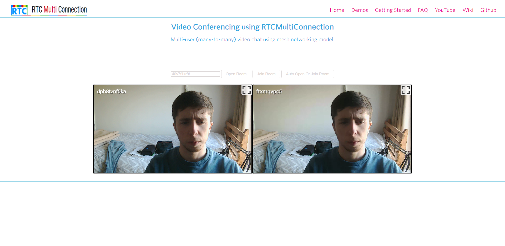

# Log Book
---
## Introduction

This log book is going to describe my research and work done in creating a videoconferencing system using WebRTC
This will be achieved by first creatinga basic webrtc connection using [this](https://github.com/muaz-khan/RTCMultiConnection) repo for reference. A stun and turn server will then be added along with a GUI and authentication
---
## Entries
### 26/01/2022
I started by cloning the RTC Multiconnect repo and testing it in my broswer. I then looked at chrome://webrtc-internals to see how the data was being sent and received.

